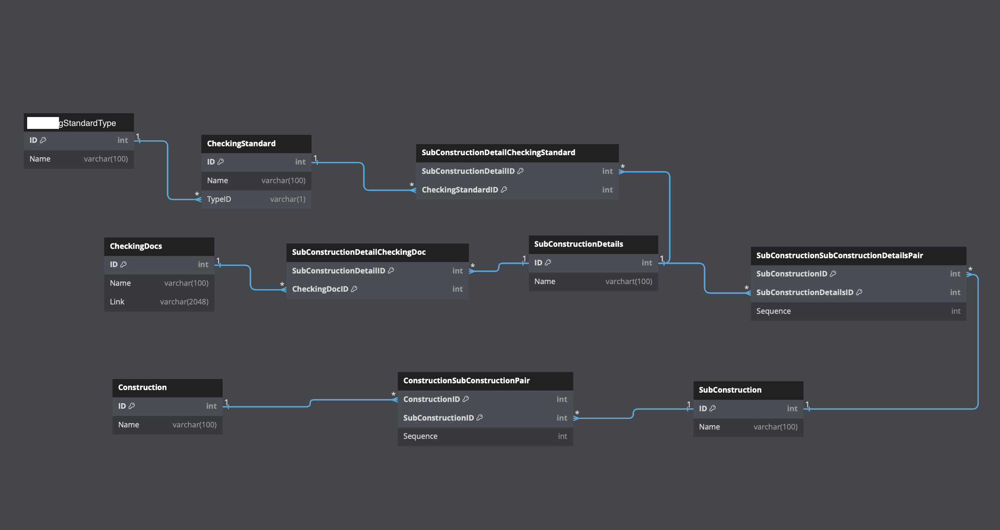

# 資料庫結構描述

此資料庫架構主要針對建設公司管理多個不同建設工程而設計，架構可以參考以下
每個大工程底下會有多個子工程，子工程底下又有多個子工程細項，每個子工程細項需要數個檢查表與通過數個檢查標準。

'''
類神經網路大樓工程 (大工程)
├── 順序1 xx工程 (子工程)
├── 順序2 假設工程 
│   ├── 順序1 基地整地 (子工程細項)
│   ├── 順序2 施工便道工程 
│   │   ├──  開挖作業安全檢查表(檢查表)
│   │   ├──  露天開挖作業安全檢查表
│   │   ├──  一般安衛檢查表
│   ├── 順序3 安全走廊工程
│   ├── 順序4 安全圍籬工程
│   │   ├──  圍籬及大門作業安全檢查表(檢查表)
│   │   ├──  採光及照明安全檢查表
│   │   ├──  一般安衛檢查表
│   │   ├──  吊裝作業前安全檢查表
│   │   ├──  鐵路沿線施工安全檢查表
│   │   ├──  A.02臨時用電 (水銀燈) (檢查標準)
......

'''

下圖為資料庫設計圖 
創建資料庫 sql code 可以參考 [tables.sql](./tables.sql)

以下範例將利用 [範例資料](../職安知識庫一覽表.xlsx)作為參考

## Tables

### 1. `Construction`
- Stores information about different construction projects. 存儲有關不同建設專案的資訊。 ex: (1, 類神經網路大樓工程)
- **Columns**:
  - `ID` (Primary Key): Unique identifier for each construction project.
  - `Name`: Name of the construction project.

### 2. `SubConstruction`
- Represents subdivisions of a construction project. 表示建設專案的子級劃分。 ex: (1, xx工程), (2, 假設工程)
- **Columns**:
  - `ID` (Primary Key): Unique identifier for each sub-construction.
  - `Name`: Name of the sub-construction.

### 3. `SubConstructionDetails`
- Stores detailed information about each sub-construction. 存儲有關每個子建設的詳細資訊。 ex: (1, 基地整地), (2, 施工便道工程)
- **Columns**:
  - `ID` (Primary Key): Unique identifier for sub-construction details.
  - `Name`: Name of the sub-construction detail.

### 4. `CheckingDocs`
- Contains documents used for checking and verifying construction details. 包含用於檢查和驗證建設細節的文件。 ex: (1, 開挖作業安全檢查表, 開挖作業安全檢查表.doc)
- **Columns**:
  - `ID` (Primary Key): Unique identifier for each document.
  - `Name`: Name of the checking document.
  - `Link`: URL link to the checking document.

### 5. `CheckingStandard`
- Defines various checking standards used in construction projects. 定義用於建設專案的各種檢查標準。 ex: (1, 臨時照明 (日光燈), 1)
- **Columns**:
  - `ID` (Primary Key): Unique identifier for each checking standard.
  - `Name`: Name of the checking standard.
  - `TypeID` (Foreign Key): References `Type(ID)` to associate a standard with a type.

### 6. `CheckingStandardType`
- Stores types of checking standards or classifications. 存儲檢查標準或分類的類型。 ex: (1, 一般其他類, A), (2, 墜落防止, B)
- **Columns**:
  - `ID` (Primary Key): Unique identifier for each type.
  - `Name`: Name of the type.
  - `Symbol`: A single character symbol to represent the type.

### 7. `ConstructionSubConstructionPair`
- Defines the relationship between a construction and its sub-constructions, with sequencing for organization. 大工程與子工程關聯 ex: (1<類神經網路大樓工程於Construction Table 中的 ID>, 2<假設工程於SubConstruction Table 中的 ID>, 2<假設工程於類神經網路大樓工程 中的 執行順序>)
- **Columns**:
  - `ConstructionID` (Foreign Key): References `Construction(ID)`.
  - `SubConstructionID` (Foreign Key): References `SubConstruction(ID)`.
  - `Sequence`: Order or sequence number for the sub-constructions within a construction.

### 8. `SubConstructionSubConstructionDetailsPair`
- Links sub-constructions to their details with a defined sequence. 子工程與子工程細項的關聯。
- **Columns**:
  - `SubConstructionID` (Foreign Key): References `SubConstruction(ID)`.
  - `SubConstructionDetailsID` (Foreign Key): References `SubConstructionDetails(ID)`.
  - `Sequence`: Order for the details within a sub-construction.

### 9. `SubConstructionDetailCheckingDoc`
- Maps checking documents to sub-construction details. 檢查表與子工程細項的關聯。
- **Columns**:
  - `SubConstructionDetailID` (Foreign Key): References `SubConstructionDetails(ID)`.
  - `CheckingDocID` (Foreign Key): References `CheckingDocs(ID)`.

### 10. `SubConstructionDetailCheckingStandard`
- Links checking standards to sub-construction details. 檢查標準與子工程細項的關聯。
- **Columns**:
  - `SubConstructionDetailID` (Foreign Key): References `SubConstructionDetails(ID)`.
  - `CheckingStandardID` (Foreign Key): References `CheckingStandard(ID)`.

## Foreign Key Relationships

- `CheckingStandard(TypeID)` → `CheckingStandardType(ID)`: Each checking standard is associated with a type.
- `ConstructionSubConstructionPair(ConstructionID)` → `Construction(ID)`: Links a construction to its sub-constructions.
- `ConstructionSubConstructionPair(SubConstructionID)` → `SubConstruction(ID)`: Links a sub-construction to a construction.
- `SubConstructionSubConstructionDetailsPair(SubConstructionID)` → `SubConstruction(ID)`: Connects a sub-construction to its details.
- `SubConstructionSubConstructionDetailsPair(SubConstructionDetailsID)` → `SubConstructionDetails(ID)`: Links sub-construction details to sub-constructions.
- `SubConstructionDetailCheckingDoc(SubConstructionDetailID)` → `SubConstructionDetails(ID)`: Links sub-construction details to checking documents.
- `SubConstructionDetailCheckingDoc(CheckingDocID)` → `CheckingDocs(ID)`: Connects checking documents to sub-construction details.
- `SubConstructionDetailCheckingStandard(SubConstructionDetailID)` → `SubConstructionDetails(ID)`: Links sub-construction details to checking standards.
- `SubConstructionDetailCheckingStandard(CheckingStandardID)` → `CheckingStandard(ID)`: Connects checking standards to sub-construction details.

